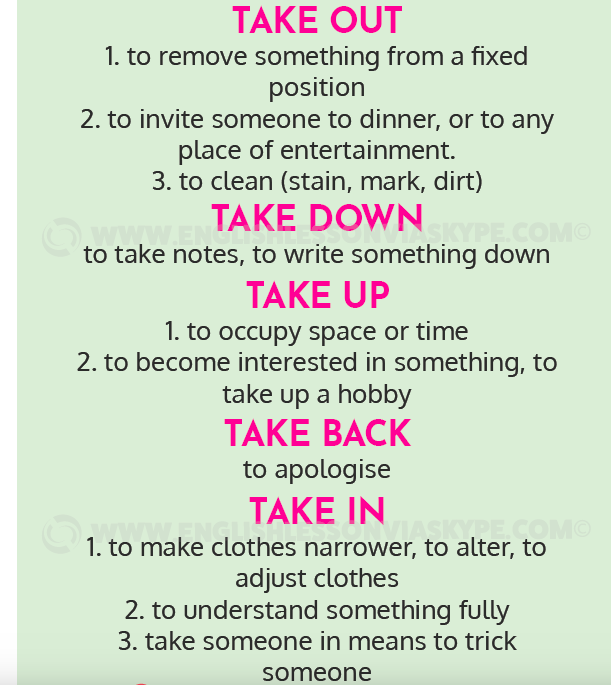

# NOTEPAD - COMMON

# ARTICLES - GRAMMAR

## Terms

- conjugate a verb

  

## On / In / At

- I'll be back **in** the afternoon.

- At night

- In the morning

- In Summer

- In Winter

- On Monday, Tuesday

## Must/Have To/Should

### Formal Vs unformal

Must - formal, often used in writting

Have to - unformal, prefer it when to speak

### You decision Vs Situation

Must - own decision

Have to - doctor's decision (situation)

### MUST

1. Obligation
2. Strong advice
3. Something forbidden (rule)

### Should

1. Advice
   - Prefer **shouldn't** if it's advice (not mustn't)

**I think (option)**

## If I do VS if I did

### Usage

- Regret
- Assumption
- Imagination
- Suggestion
- Wishes

### Usage 2

- Fact
- Imagination
- Suggestion

### Examples

**Murphy p. 313 ex. 19 -> Answer p. 369**

1. If **you found**, a wallet in the street, what would you do with it? (you / find)

2. I must hurry. My friend will be annoyed if **I’m not** on time. (I / not / be)

3. I didn't realise that Gary was in hospital. If **I'd known** he was in hospital, I would have gone to visit him. (I / know)

4. If the phone **rings**, can you answer it? (ring)

5. I can't decide what to do. What would you do if **you were** in my position?(you / be)

6. a : What shall we do tomorrow?
   b : Well, if **it's** a nice day, we can go to the beach. (it / be)
   
7. a : Let's go to the beach.
   b : No, it's too cold. If **it was** warmer, I wouldn't mind going. (it / be)
   
8. a : Did you go to the beach yesterday?
   b : No, it was too cold. If **it had been** warmer, we might have gone. (it / be)
   
9. If **you had** enough money to go anywhere in the world, where would you go? (you / have)

10. I'm glad we had a map. I'm sure we would have got lost if **we hadn't had** one. (we / not / have)

11. The accident was your fault. If **you had driven/you had been driving** more carefully, it wouldn't have happened. (you / drive)

12. a : Why do you read newspapers?
    b : Well, if **I didn't read** newspapers, I wouldn't know what was happening in the world. (I / not / read)
    
    

**Murphy p. 314 ex 20 ->**

1. Lisa is tired all the time. She shouldn't go to bed so late.
   - If Lisa **didn't go** to bed so late, she wouldn't be tired all the time.
2. It's getting late. I don't think Sarah will come to see us now.
   - I'd be surprised if Sarah **came** to see us now.
3. I'm sorry I disturbed you. I didn't know you were busy.
   - If I **had known** you were busy, I **wouldn't have disturbed** you.
4. I don't want them to be upset, so I've decided not to tell them what happened.
   - **They would be** upset if I **told** them what happened.
5. The dog attacked you, but only because you frightened it.
   - If you **hadn't frightened** the dog, it **wouldn't have attached** you.
6. Unfortunately I didn't have an umbrella and so I got very wet in the rain.
   - I **wouldn't have gotten** so wet if I **had had** an umbrella.
7. Martin failed his driving test. He was very nervous and that's why he failed.
   - If he **hadn't been** so nervous, he **would have passed** the test.

**Murphy p. 314 ex 21 ->**

1. I'd go out tonight if I wasn't feeling so tired.
2. I'd have gone out last night if I hadn't had so much to do.
3. If you hadn't reminded me, I would have forgotten Jane's birthday.
4. If I had my camera, I would take a picture of you.
5. If you give me the camera, I will take a picture of you.
6. Who would you phone if you were in trouble.
7. We wouldn't have been late if you hadn't taken so long to get ready.
8. If I'd been able to get a ticket,I would have gone to the concert.
9. If I'd done better at the interview, I might have got the job.
10. You wouldn't be hungry now if you had eaten lunch.
11. Cities would be nicer places if there was less traffic.
12. If there was no TV, people would go out more.

## TODO -> I haven't VS I don't have

**I haven’t or I don’t have**

**Have** is an interesting verb in that it serves many purposes. 

Can be used as an auxiliary verb and the main verb

Used as an auxiliary verb or helping verb

For example, when we use **have** to make perfect tense forms, we use it as an auxiliary verb. Examples are given below.

- I **have eaten** breakfast. when?
- She **has broken** her arm. When? Sometime in the past
- I **have seen** that film. Harriet

In the three sentences given above, **have** doesn’t really have a meaning. It merely helps the other verbs (eat, break and see) to form their present perfect tense forms.

**Have** can also be used an **ordinary (main) verb**. 

In this case, it has a meaning. The ordinary verb **have** is used to express ideas such as possession, personal characteristics, relationships etc.

I have a Toyota.

- He **has** a fleet of cars. (He owns those cars.)
- She **has** a nice personality. (Personal characteristics)
- They **have** a daughter. (Relationships)

In all of these three sentences, **have** is the main verb. **As you can see, there are no other verbs in these sentences.**

When **have** is used as an auxiliary verb, we make questions by putting it before the subject. It is quite simple.

- She **has written** a novel. (Statement)
- **Has** she **written** a novel? (Question)
- Did 

When **have** is used as an ordinary verb, we make questions and negative forms with **do.**

Study the examples given below.

- She **has** a daughter. (Statement)
- She **does not have** a daughter. (Negative) (NOT She hasn’t a daughter.)
- **Does** she **have** a daughter? (Question) (NOT Hasn’t she a daughter?)
- They **have** many friends.
- They **do not have** many friends.
- **Do** they **have** many friends? Have they many friends?
- I have no time. **I don’t have any time.** Don’t you have any time?

**Sometimes, you might hear people saying ‘She hasn’t a daughter’ or ‘I haven’t a car’, but remember that these forms are incorrect and very unusual.**

**Conjugate a verb collocations**

 Negative sentences in English require a helping verb to come before the word “not,” and when there is no other helping verb to be had, it’s “do” that steps in. So instead of just putting “no” or “not” at the beginning or the end of a sentence as many other languages do, English uses “do not” or “don’t.”

 

 **Must  and have to shows obligation**

I must talk to her before she leaves. Own decision

Must is more formal All passengers must have a ticket.

Use have to in spoken English. Must sounds strange.

I have to go to work tomorrow.  situational

**Must not and don’t have to are different**

Visitors must not touch the paintings.it’s forbidden

You don’t have to be here before ten. Not necessary but you  have a choice

Passengers must not talk to the driver while the bus is moving. Forbidden 

You don’t have to finish it today. Have a choice

**Should** is used for advice or give opinions not for obligations the person has a choice

You should go to bed earlier then you wouldn't feel so tired.

He should do more work if he wants to get promoted.

**Must can be used to give advice** You must try the fish.  It’s  delicious more emphatic stronger You really like the fish.

You have to try the fish.  It is delicious.

**When giving negative advice only use shouldn’t**   

You **shouldn't** take the job if you don’t like the long commute.Give advice or express an opinion

Don’t use mustn't don’t have to

**MUST**

Must **obligations** you feel strongly about

I must remember to get him a birthday present.

Obligations in formal written English

All employees must wash their hands.

**Strong advice**

You must read it. It is an amazing story.

**Saying something is forbidden**

Children must not  be left unattended.

In spoken English it is more common to say can’t

**Have to**

Obligations that depend on circumstances

I have to wear glasses because I can’t see so clearly.

Most obligations in spoken English

Do you have to work tomorrow?

Saying something is not necessary

You don’t have to do this if you don’t want to.

Strong advice

You have to try this ice cream.

**Should giving advice**

You should try once more. I’m sure you’ll get it.

**Giving negative advice**

You shouldn’t work so hard. Take a break.

Giving your opinion

If they make us work overtime, they should pay us for it.

Question 1
Do you think I __should_______ apply for this job? Giving advice
A
should
B
must
C
have to
D
don't have to

Question 2
I think the government __should______ help young people to find jobs.expressing opinion
A
has to
B
mustn't
C
must
D
should

Question 3
I __have to______ leave now—I have a driving lesson.
A
must
B
don't have to
C
shouldn't
D
have to

Question 4
The film was rubbish. You _________ see it.shouldn’t see it
A
shouldn't
B
mustn't
C
don't have to
D
should
Hey! You ________ smoke in here!
A
Should not
B
haven't to
C
mustn't
D
Don’t have to
6.You ________ stay up too late if you have an exam tomorrow.

have to

shouldn't

must

don't have to
7.It’s a public holiday tomorrow, so I ________ go to work.
Must not
Should not
Don’t have to
Must

8.All employees _must_______ wash hands before starting work.

must

don't have to

Mustn't
should

9.What time ________ meet him?
You must
Have you to
Do you have to
Must you

10.You _________ buy tickets in advance—you can’t buy them the same day.
Don’t have to
Should
Must

## Does (~~Do~~) everybody

- nobody
- anybody
- somebody
- There was a fight at the party, but **nobody was** hurt. 

## Where did you have your hair cut? Which hairdresser did you go to?

- ~~did you cut your hair~~ неправильно, так как он не сам стригся, а его стригил. И тут пасивный залог заменяется, конструкцией `did you have something`

## ??? Does he prohibited clean his room VS Is he prohibited clean his room

## Didn't have VS There wasn't

- Cities would be nicer places if it didn't have traffic.

- Cities would be nicer places if there wasn't traffic.

- Cities would be nicer places if there was less traffic.

  

# ARTICLES - CONTEXT - Small talks

## General

- Share with us
- Over to you - Вам слово
- Go for it - Действуй, дерзай

## Greeting

- Hello [name], How are you?
- Hi, [name]. How are you getting on?
- Hello, How are you doing?

## Weather

- Temperature ranges from 30 to 34 degrees.
- Vitamin D - luck of sunshine
- Многих людей бесит такая погода!

## Weekend/Holiday

- How you enjoyed your weekend?
- How did you enjoy your weekend?
- How was your weekend?
- The holidays are just around the corner

## Traveling

### General

- Who went with you on your trip to UAE? 
- Is it a popular destination? 
- High season 
- Low season
- How long does it take to get there? 
  - Flying takes 6 hours
- As I had hoped
- How is (was) your trip?

### Clothes

- Should you adhere by the dress code?
- Do you cover your neck?
- Did not have to adhere to the dress code on the beach.
- How many sweaters are you wearing?

## Decease/Illness

- I have a sore throat
- I have running nose (runny nose)
- Pneumonia
- Hi guys! I caught a cold so can’t see u tomorrow((
  - Get well(coffee)
  - Many thanks) I do my best!
- Be healthy
- Take care of yourself
- I'm feeling sick

## Web-meeting

### General

- I'm back
- He will be a bit later. He asked to start without him. He'll join (?to) us as soon as he can.
- I am looking forward to seeing you on Thursday!

### Browser navigation

- Let's go back to the previous page

### Problems

- Let me call back! (Need to restart the laptop)
- I can't hear you.
  - Oh, something happened with my headphones, but now it works.
- I can't see you (Skype), (~~I don't see you~~), 
- I should charge my laptop.
  - Here we go! .. Sorry.. Go ahead!
- My computer is booting.

## Email

- inquire is inform ask
- I regret -> I sorry (info)

## Slang

- Chick flicks - кино для девочек, мелодрамы
- Сouch potatoes - "овощи", постоянно сидят дома и смотрят телевизор

## Countries

- Budapest [**bu**-da-pesht] is the capital of Hungary [ˈhʌŋɡəri].
  - Hungarians [hʌŋˈɡeriən] are people who live in Hungary.

# ARTICLES - CONTEXT - OTHERS

## Abbreviation

1. TIA - Thanks in advance

2. IMO - In my opinion
3. 21'' screen - 21 inch screen

## Common

- She has gone (Oна ушла)
- The time flies so much

## Dog

- He will be bringing his dog.
- I should look after his dog.

## Money

- I will be broke (I don't have money)

## Work

- If I get fired from my job I wouldn't have money.

# ARTICLES - PHRASAL VERBS

## General

- Let's wrap up - Давайте заканчивать
- 

## Business phrasal verbs

**SORT OUT**

Meaning: To resolve/fix a problem or difficult situation.

I don't care how you do it, but you have to SORT this problem OUT now! If you don't, it's just going to get worse.

"Are you still having problems with Sue at work?"

"No, we had a long conversation last weekend and SORTED it OUT. Everything is fine between us now."

**TAKE CARE OF**

Meaning: To be responsible for making sure that something is done.

Peter, it's really important that they are told about the changes. I can't do it. So, can you TAKE CARE OF it for me?

Don't worry, I'll TAKE CARE OF organising the party (getting the drinks, booking the place etc...). You just have to invite people to it.

**CARRY OUT**

Meaning: To do/perform a task (or tasks) you have promised or been told to do.

Ok, you need to CARRY OUT my instructions exactly as I say. First, print the summary and give it to Tyra to proofread it and then make her changes. 

Make sure that it's CARRIED OUT by Thursday at the latest. If you don't do it by then, it's going to cause us big problems.

**LOOK INTO**

Meaning: To investigate/examine what the cause of something is, whether something is true or if something is possible.

We still don't know why it happened, but we are LOOKING INTO it. As soon as we know anything, we'll let you know.

What you've suggested we do is a very good idea, but I'm not sure it's possible. I need to LOOK INTO it before I can say if we are going to try to do it or not.

**GO OVER**

Meaning: To explain something to somebody so they understand it and/or know what to do.

If you don't understand how to use a grammatical structure you have learnt in your English class, ask the teacher to GO OVER it again with you. You should understand it then.

Thank you all for agreeing to work for free at tomorrow's festival. Now, I'll GO OVER what's happening on the day and what you each have to do there.

**DEAL WITH**

Meaning: To be responsible for or take responsibility to resolve things (e.g. difficult situations, problems etc...).

"There's a problem with a customer and l don't know what to do."

"Don't worry, leave it to me. I'll DEAL WITH it."

When you work as a receptionist in a hotel you have to DEAL WITH all the problems and requests that the guests staying there may have..

**FIND OUT**

Meaning: To learn something through investigation or discovery that you don't currently know.

"What time does the train to London leave on Friday?"

"I don't know, but I'll FIND OUT and tell you this afternoon."

I was talking to James this morning and I FOUND OUT why he didn't come to the party. His parents told him that he couldn't.

## Examples

1. I've had this problem with my computer as well. If you delete some files and then restart it, it should **sort out** the problem and it will be working again. 

2. I'm on holiday next week, so I can't write the weekly report for next week. So, would you mind **taking care of** it for me while I'm away?

3. Have you **found out** if we are getting an end of the year bonus yet?

4. My boss is on vacation so I not only have my own work to do but I also have to **deal with** his problems also. 

5. The pilot has to **carry out** a series of complex maneuvers procedures.

6. The government will **look into** how to reduce unemployment.

7. We brought in a management consultant to **sort out** the mess.

8. I always **go over** my notes just before I make a presentation.

   

## TODO -> LOOK

1. Look up - to try to find a particular piece of information by looking in a book or on a list, or by using a computer
2. Look over - review
3. Look through - flipping through
4. Look in - check on
5. Looking through magazines you are flipping through the pages of the magazines. 
6. Look on - watch without getting involved.
7. Look away - To turn one's face away (from someone or something);
8. Look back - remember also can say look back on reminisce
9. Look into - investigate
10. Look up to - respect
11. Look forward to - get excited about

**Practice complete the phrasal verb “look” with the appropriate preposition.**

1. Henry **looked through** (reviewed) the reports quickly.
2. How do you feel when you **look back on** (remember) your career as a manager? Any regrets?
3. Please can you **look up** (find) this word in the dictionary, I don't know what it means.
4. I really don't know what I want to do when I leave the company! I'll have to **look into** (investigate) it.
5. I really **look up to** (respect) my director in the company. I think he's a great role model for me.
6. I really **look forward to**(excited about it) my annual vacation.
7. Please could you **look over** (review) my email and check for any mistakes?
8. When I **look back on** (remember) my life, I realize how much I have grown as a person.
9. It was the most beautiful sight I had ever seen, it was hard to **look away** (turn my head).

## TODO -> GET 

1. Get down to - Заняться чем-то серьезно
3. Get by - Выживать
4. Get into - Залезть в (машину)
5. Get out of - Вылезти из (машины)
6. Get at - Намекать
7. Get back at - Отомстить кому-то
8. Get along - Ладить с кем-то
9. Get on (with) - Ладить с кем-то
10. Get across -> Донести идею до слушателя
11. Get over - Оправиться от чего-либо, пережить
12. Get on - Зайти в автобуса
13. Get off - Выйти из автобуса
14. Get away (context -> bad, crime) - Выходить сухим из воды
14. Get out of  (context -> not bad, responsibility) - Избегать чего-то
15. Get up - Вставать
16. Get around - Путешествовать

**Exercise**

1. We tried to **get** our point **across**, but he just wouldn't listen.
   - get across
   - get around
   - get together

2. My boss and I don't **get along** at all.
    - get along
  - get on
  - get in
3. It's OK. Don't worry. You'll **get over** this.
    - get along
  - get on
  - get over
4. The museum? You should **get off** at the third stop.
    - get through
  - get off
  - get on
5. As soon as he **got on** the horse, I knew that he had never been on one before.
    - got on
  - got around
  - got in
6. Tyra tried to **get away with** cheating on her Math test but the teacher found out and gave her an “F.”
     - get away with
     - got rid of
     - got off
7. I'm really tired because I **got up** at 5 AM this morning. 
     - got around
     - got up 
     - got on
8. Friends can help you to **get over** a difficult time in your life. 
     - get around
     - get by
     - get over
9. Rachel is short of cash this month, she barely has enough money to **get by**.
     - get on
     - get over
     - get by
10. Donnie had to clean his room on Saturday but he tried to **get out of** it by telling his mom he was allergic to dust.
  - Get by
  - Get out of
  - get over  

**Exercise 2**

1. She went to bed at ten, got ... at seven, took a shower, went to the kitchen, and made breakfast.
   - down
   - in
   - out
   - **up**

2. We went there by bus. We got on the bus on Fifth Street and got ... at the park.
   - down
   - **off**
   - out of
   - Through

3. Her sad story really got to me.  I hope she gets ... her grief.
   - by
   - **over**
   - up
   - with

4. We were on vacation in Greece. We got ... yesterday.
   - **back**
   - out
   - over
   - through

5. My son tried to get  ... of washing his car and said he would just wait until it rains.
   - about
   - **out**
   - on
   - off

6. It was a great party. We should get ... again sometime.
   - around
   - by
   - **together**
   - with

7. He pulled up at the bank and got ... the car.
   - back to
   - into
   - off
   - **out of**

8. She is a little **under the weather** now, but she will get ... it soon.
   - by
   - into
   - off
   - **over**

9. His work on his new project is getting ... quite well.
   - **along**
   - away
   - out
   - over

10. Melanie is always lying, I can’t understand how she gets ... with it.
    - along
    - up
    - **away**

## TODO -> TAKE

1. **Take off** - Like many other phrasal verbs ‘take off’ has more than one meaning.
   1. to leave the ground plane takes off .
      Ex. Our flight took off on time.
   2. to remove something
      Ex. If it is hot outside, you take off your shirt.
   3. to take time as a holiday
      Ex. Chris took off 3 weeks in the middle of July.

2. **Take out**
   1. to remove something from a fixed position
   2. to invite someone to dinner, or to any place of entertainment
   3. to clean (strain, mark, dirt)

3. **Take down**
   
1. to take notes, to write something down
   
4. **Take up**
   1. to occupy space or time 
   2. to become interested in something, to take up a hobby

5. **Take back** 
   
1. to apologize
   
6. **Take in** 

   1. to make clothes narrower, to alter, to adjust clothes

      For example, you lost weight and now your jeans are too loose in the waist. So you go to the tailor and ask him to take them in the waist.
      Ex. Can you please take in these jeans in the waist?

   2. to understand something fully

      Ex. Phrasal verbs are difficult to take in.

   3. to take someone in means to trick someone

      Ex. I was completely taken in by him.

7. **Take apart**

   1. to divide something into smaller parts, to disassemble, to break it up
      Ex. His mobile wasn’t working properly, and he decided to take it apart.

8. **Take after**
   1. to resemble in appearance or character
      Ex. Jamie is very ambitious, he takes up after his dad.
9. **Take over**
   1. to control or to possess something.
      Ex. I am going to take over the world.
      We pulled off the motorway, and Mary took over driving.
10. **Take on**
    1. to employ someone.
       Ex. Will he take me on?
    2. to accept something, to undertake to do something.
       Ex. I don’t think I can take this work on at the moment as I am very busy.
11. **Take down**
    1. Write notes
    2. Remove something 
       I took down all the pictures of my ex-boyfriend.

**Exercise** 

**HOMEWORK**

1. He looks like his mother; he takes ... her.

   - **after**
   - to
   - for

2. Do you take ... your mother or father?

   - <u>after</u>
   - in
   - for

3. The plane couldn't take ... because of the heavy snowfall.

   - <u>off</u>

   - up

   - to

4. He took ... swimming when his doctor told him he needed to get more exercise.

   - after
   - <u>up</u>
   - in

5. You should take ... Christmas decorations on the 6th of January.
   - up
   - to
   - <u>down</u>
6. He took ... everything the lecturer said in his notebook.
   - up
   - <u>down</u>
   - on

7. He spoke too quickly for us to take ... everything he said.
   - <u>in</u>
   - on
   - to

8. Can you take this phone number ... for me, please?
   - up
   - in
   - <u>down</u>

9. They took the company ... when it went bankrupt
   1. in
   2. down
   3. over

10. I took my hat ... when I entered the building.
    - <u>off</u>
    - on
    - in

11. She took her clothes ... and went to bed when she got home from work.
    - <u>off</u>
    - on
    - down

12. He refused to take ... what he had said even though he knew he was wrong
    - in
    - <u>back</u>
    - off

13. She took a lodger/rental person ... to help pay the rent.
    - <u>on</u>
    - down
    - in

14. I couldn't put the radio back together after I had taken it ... .
    - off
    - <u>out on</u>
    - apart

## TODO -> OTHERS

**SORT OUT**

Meaning: To resolve/fix a problem or difficult situation.

I don't care how you do it, but you have to SORT this problem OUT now! If you don't, it's just going to get worse.

"Are you still having problems with Sue at work?"

"No, we had a long conversation last weekend and SORTED it OUT. Everything is fine between us now."

**TAKE CARE OF**

Meaning: To be responsible for making sure that something is done.

Peter, it's really important that they are told about the changes. I can't do it. So, can you TAKE CARE OF it for me?

Don't worry, I'll TAKE CARE OF organising the party (getting the drinks, booking the place etc...). You just have to invite people to it.

**CARRY OUT**

Meaning: To do/perform a task (or tasks) you have promised or been told to do.

Ok, you need to CARRY OUT my instructions exactly as I say. First, print the summary and give it to Tyra to proofread it and then make her changes. 

Make sure that it's CARRIED OUT by Thursday at the latest. If you don't do it by then, it's going to cause us big problems.

**LOOK INTO**

Meaning: To investigate/examine what the cause of something is, whether something is true or if something is possible.

We still don't know why it happened, but we are LOOKING INTO it. As soon as we know anything, we'll let you know.

What you've suggested we do is a very good idea, but I'm not sure it's possible. I need to LOOK INTO it before I can say if we are going to try to do it or not.

**GO OVER**

Meaning: To explain something to somebody so they understand it and/or know what to do.

If you don't understand how to use a grammatical structure you have learnt in your English class, ask the teacher to GO OVER it again with you. You should understand it then.

Thank you all for agreeing to work for free at tomorrow's festival. Now, I'll GO OVER what's happening on the day and what you each have to do there.

**DEAL WITH**

Meaning: To be responsible for or take responsibility to resolve things (e.g. difficult situations, problems etc...).

"There's a problem with a customer and l don't know what to do."

"Don't worry, leave it to me. I'll DEAL WITH it."

When you work as a receptionist in a hotel you have to DEAL WITH all the problems and requests that the guests staying there may have..

**FIND OUT**

Meaning: To learn something through investigation or discovery that you don't currently know.

"What time does the train to London leave on Friday?"

"I don't know, but I'll FIND OUT and tell you this afternoon."

I was talking to James this morning and I FOUND OUT why he didn't come to the party. His parents told him that he couldn't.

1. I've had this problem with my computer as well. If you delete some files and then restart it, it should    sort out________the problem and it will be working again. 
2. I'm on holiday next week, so I can't write the weekly report for next week. So, would you mind   _taking care of _________  it for me while I'm away?   
3. Have you found out______ if we are getting an end of the year bonus yet?
4. My boss is on vacation so I not only have my own work to do but I also have to _______ deal with______his problems also. 
5. The pilot has to _carry out_____a series of complex maneuvers procedures.
6. The government will _look into______ how to reduce unemployment.
7. We brought in a management consultant to __sort out___ the mess.
8. I always __go over___ my  notes just before I make a presentation.

# Russian English

- Take a photo -> Take a picture
  - If we take a picture together in Bali, It will be cool.

# Peoples

## Jennifer

- Jennifer's birthday on 29/11/2019
- Jennifer's mother and ex-boyfriend birthday on 22/11/2019
- Her ex-boyfriend teaches in the university. He teaches Russian language. Also he helped her sister with admission in the university where he works.
- Jennifer doesn't like cold Russian weather.
- Боится высоты

**Phrases**

1. You are not sorry! If you are sorry help me!

**Mothers words**

1. Do as much business as you can! One of them is going make your popular.
2. Don't give up! Put your eggs in different baskets. One is going to crack.

## Karyn 

- She lives in Atlanta (California).
- The temperature is quite stable, and all summer was about 30-35 degrees.
- Atlanta, 17 -> 2 degrees.

## Yulia

- Ездила в [Шарджа](https://tonkosti.ru/%D0%A8%D0%B0%D1%80%D0%B4%D0%B6%D0%B0) в ноябре самый сезон. Temperature is 30-32, water - 25. High season in November. По погоде гуд, но дорого и скучно. 
- Her husband likes Austria, but she hasn't been there yet.
- Ездила в Финляндию на выходные в 22-23.11. Говорит скучно.

# WORKING

## Phrases and word

2. He looks classy.
3. It's very convenient for me
4. Have a great weekend!
5. I am dying to find out!
6. Очень много эээ, уммм, Нужно говорить `more fluency`
   - You know..
   - So..

# !!!-----------CURRENT-----------!!!

- [Business Writing](https://docs.google.com/document/d/1OFjecIys_sL1DQUC_AFz3fsprPJgMXeGR-cSGEuu_bk/edit#heading=h.yhh37lsu26kw)
- [Phrasal Verbs](https://docs.google.com/document/d/1VPEFJsj8VrqXoHiEt_vT-cWSlKXDOwYO5P2zpQoQhAY/edit)

## Greeting -> Weather -> Weekend

- Hi, Karyn. How are you getting on?

- We had snowfall on Sunday
  - And now there are a lot of snow in Saint-Petersburg. 
  - You know...
  - Snow melts and it becomes dirty .. nice weather.
  - Snow melts -> we call it -> stick ?? Snow sticks on the street

## HOWEWORK

## CURRENT

# Pronunciation

- Lamborghini - [Ламборгини] - если после "g" стоит "h", то оно читается как "Г".
  - Lamborghini Urus is the world's first Super Sport Utility Vehicle
- Jaguar - [**ja**·gwaar]
  - Jaguar is the luxury vehicle brand of Jaguar Land Rover.
- Procedure - [pruh·**see**·jr]
  - The police are now reviewing procedures.
- Pneumonia - [nuh·**mow**·nyuh]
  - Pneumonia starts when a virus, fungus, or bacterium get into one of your lungs.
- New York - [njuː ˈjɔːk]
  - She started a job in New York City.
- Fall - fell - fallen
  - He fell badly and broke his leg.
- Wake - woke (waked) - woken (waked)
  - I woke up with a headache.
- Taxi - [ˈtæk.si]
  - Shall we hail a taxi?
- Through [θruː/] - фру
  - They walked slowly through the woods.
- TV - [tiːˈvi] - [тивИ]
  - We could stay in and watch TV.
- Finance - [ˈfaɪnæns]
  - Regarding (In reference to)  finance workshop, Hannah King will lead it at 6:30pm. (~~As regards~~)
- Year - [jɪə(r)] -> [йиэа(р)]
  - How many years did it take?
- Clothes - [kləʊðz] -> **[клоз]**
  - I went shopping for clothes *<u>([cloz] not [clovez])</u>* and got a jacket and some shorts.
- [Author](https://www.youtube.com/watch?v=l4885Cf4CLs) - [ˈɔːθə] -> **[oфэ]**
  
  - What does the author mean?
- Service - [ˈsɜː(r)vɪs] - **[сЁрвис]** not [cёрвайс]

  - What do you know about customer service?
- Percentage - [pəˈsentɪdʒ], Percent - [pəˈsent]
  
  - I'm a hundred percent sure!
  - Не используется во множественной форме!
- Hear - [hɪə(r)] - **[хиə]**

  - I don't hear you well!
- Weekend - [**wiːkˈend**]

  - How was your weekend?

# ARCHIVE of Phrases

- It helps to be focused on ....effectivity.
- Straight to the point (Приступить сразу к делу)
- Oh, maybe it's that (А может быть и так!)
- I don't get it (Я не понимаю)
- What's on at the cinema at the moment (Что идет в кино сейчас)
- I have a business (У меня есть дело)
- Oh, save us! (О, спаси нас!)
- I'll get back to you (Я свяжусь с вами)
- no probs - без проблем
- Taxi is over here.
- How you enjoyed your weekend?
- Sorry, it was nice talking to you but I have to go now. I have another appointment today. Bye.
- Regarding (In reference to) finance workshop
- I relate (I had experience)
- Jane was supposed to phone me last night, but she didn't. (Джен должна была позвонить мне..)
- 9 am - nine am sharp

- My wife keeps grounded!

- My internet is messing up today

- How is it spelt (spelled)?

- I would treat anything he says with extreme caution!

- We had a big argument but now it is time to clear the air - 

- Golf isn't his cup of tea - Гольф не его конек.

- Put all your eggs in a basket

- I shouldn't have done it. (Я не должен был этого делать!)

  

# JOURNAL

**05/12/2019**

 **Business Email Phrases**

**1**  You can    <u>Could you</u>    You will    You 

please arrange accommodation for me near to your offices? 

**2** We  __________ if you could send us the confirmation as soon as possible. 

will be grateful  . . <u>would be grateful</u> . . .  would be happy . . .  will be glad

**3** Unfortunately we  _________to change the contract. 

can't    cannot    <u>are unable</u>     unable

**4** If possible I  _______ to make an appointment to see you to discuss the new contract for next year. want  . . . <u>would like</u>  . . . .  would . . like

**5** I  ______________at the sales meeting next week. 

 look forward to       look forward for seeing      look to     <u>look forward to seeing you</u>

**6** Feel to _________contact me if you need any more information. 

 Glad . .  <u>free</u>  . . fine .  . liberated 

**7** I have placed an order but need some more details ___________shipment. 

 For    . on      <u>regarding</u>      concerned 

**8** Do not __________ contact me if you need any more information. 

Wait to     stop     appreciate . <u>hesitate to</u> .   hesitate 

**9** Please  ??? your decision as soon as possible. 

make me . . . . . let me . . . .  know . . . give . . . let me 

**10** We look forward to a successful working relationship  ___________

in the future      <u>on future</u>     at the future     to future . 

## Karyn - 28/11/2019 - Business writing

- It is inappropriate to use **emoticons** such as smiley faces in a formal email.
- I just received a very funny email. I'll **forward** it to you so that you can read it.
- I'm sure I emailed you but I can't find the message in the **sent items** folder.
- A red exclamation mark shows that an email is **urgent** or high priority.
- Please send a **reply** as soon as possible.
- The emails in my **inbox** are sorted according to the date that they were received. The most recent are on top.
- I am sending you the updated contract in the **attachment**.
- My boss insists on being **copied** on all work-related emails.
- Unsent messages that you have saved get stored in the **drafts** folder.
- My company has just installed new **spam** filtering software.

**Email** -> TODO

1. enquire
2. order
3. unfortunately
4. afraid
5. received
6. arrange
7. delivered
8. regret
9. inform
10. assistance

**Rewrite**

1. Please, call me to arrange the conference in January.
2. Lookin forward to seeing you next weekend.
3. In my opinion Mr. Jameson's request is unnecessary.
4. Thanks in advance for your help with the Dalton account.
5. See you soon.

**Preposition**

1. in twenty minutes
2. on the weekend
3. at 5 o'clock
4. by Friday at the latest

## 13/11/2019 - Jennifer

- What happened!
- Pure accounting.
- Icon - international exam! 26 thousand rubles.
- Бугачевский accounting exam! 
- ITEL - 14 thousand rubbles.
- Tofel - 8-9 thousand rubbles.
- What would you do if you passed the exam.

## 13/11/2019

NOT CHECKED YET - Complete each question using a suitable verb.

1. a : I'm looking for Paul. **Have you seen** him?

   b : Yes, he was here a moment ago.

2. a : Why **did you go** to bed so early Last night?

   b : I was feeling very tired.

3. a : Where **are you** (going)?

   b : Just to the shop at the end of the street. I'll be back in a few minutes.

4. a : **Do you watch** TV every evening?

   b: No, only if there's something special on.

5. a : Your house is very beautiful. How long **have you lived** here?

   b : Nearly (Нели) ten years.

6. a : How was your holiday? ~~**Was it**~~ (Did you have) a nice time? (Странно звучит, 2а подряд)

   b : Yes, thanks. It was great.

7. a : **Have you seen** Sarah recently?

   b : Yes, we had lunch together a few days ago.

8. a : Can you describe the woman you saw? What **was she wearing?**

   b : A red sweater and black jeans.

9. a : I'm sorry to keep you waiting. **Have you been waiting** long?

   b: No, only about ten minutes.

10. a : How long **does it take** you to get to work in the morning?
    b : Usually about 45 minutes. It depends on the traffic.

11. a : **Have you ridden** a horse before?
    b : No, this is the first time. I'm a little nervous.

12. a : **Have you been** to the United States?

    b : No, never, but I went to Canada a few years ago.

    

## 12/11/2019 - Small talk about Weekends

Yes, I'm gonna go ~ going to go

- What are you gonna do?
- I picked up a new dress.
- It fits like a glove - fits very well
- cuter
- bulls
- To make an effort to participation it the confersation in English
- куда удаерние? weekend? **wiːkˈend**
- энтузиастикали
- It was pouring this weekend! It was raining cats and dogs.
- I was getting drenched! - Промок
- I feel you!
- I'm writing in response to your email.
- I hope this email finds you well.
- I would appeciate for you quick responce 

**h/w - Написать [email](https://docs.google.com/document/d/1YOyUn3i-4yZgHC-ky9WjeSpoTV-u3_n-Iot8DwAVENU/edit)**

## 07/11/2019

- Point of view
- Mind set
- People from another country have different mind set.

  

## 06/11/2019 - Create 10 sentences

1. There is still **abundant** food.
2. Dashed **nuisance** that you have couldn't done it.
3. Corporal punishment is **rampant** in schools and homes.
4. I have an instinctive **aversion** to him.
5. I'm a **wary** person, cautious by nature.
6. Her **notorious** brother is in prison.
7. I've got some **leftover** chicken or we could order pizza.
8. Barry is so **nonchalant**.
9. Careful, don't **jiggle** her.
10. I think **joggling** is a good exercise.

## 05/11/2019

pop over there
30 minutes
Go over there
drop in
Drop by
have some drinks
Private keep people out
gated communities

## 29/10/2019 - My speech 2

### Greeting

Good morning everyone, thank you for coming today. 

As you know, I'm Serzh and I'll be your facilitator today.

I'd like to review today's agenda with you.

### Absent

Okay, and before we get started I wanna tell you, that 

Igor Frankel (Java Programmer) is absent today. 

And Victor Manga (IT Manager) is also absent, he is sick.

They would like to send the apologies.

Okay, so, we can start now.

### Agenda

**9:00am-9:15am** - Welcome Announcements and news   

- At first, we are going to talk about "Welcome Announcements and news" from 9am to 9:15
- That is what we are doing now.

**9:15am-9:30am** Recognition of staff - Employee of the month for his quick response to the Nabisco account - Tim Simmons

- After this, from 9:15 to 9:30, Tim Simmons will present "Recognition of staff". 
- It will be about "Employee of the month for his quick response to the Nabisco account"

**9:30am-10:00am** Budget Status and planning - John Wicke-CFO

- Next on the agenda, from 9:30 to 10 o'clock, John Wicke CFO will do presentation about "Budget status ang planning"

**10:00am-10:30am** Project Updates Each manager to give a 5 minute update if you are behind schedule, on target or ahead of schedule

- After then, from 10 o'clock to 10:30, each manger will present project updates! 
- "if you are behind schedule, on target or ahead of schedule" and so on.
- Please, try to get it done in 5 minutes, we have very tight schedule!

**10:30am-10:45am** Break

- Then next on the agenda, we gonna have much needed break, Okay? From 10:30 to 10:45.
- Only 15 minutes. Be sure that you won't late and we can start on time.
- So we'll back on the meeting at 10:45..
- And Karissa Moorehouse (Agile Project Manager) will present "Agile Presentation", from 10:45 to 11:30.
- She will tell about 4 topic:

**10:45am-11:30am** Agile Presentation - Karissa Moorehouse - Agile Project Manager

- A new way to evaluate project management 				

- What did you do yesterday?

- What will you work on tomorrow?

- Do you have any obstacles?

And then finally, we'll have "Action Items AOB", from 11:30 to 12 pm.

We will discuss any other business questions..

**11:30am-12:00pm** Action Items AOB (any other business)

### Next meeting

After than we will finish out meeting, and 

the next meeting will be on 28 of November, this year, at 9:00 am in conference room D.

### Start day

Okay, we'll have a lot to do today!

And get started with first presenter Tim Simmons.

## Say about next and start Metting

## 24/10/2019 - Karyn

## [Doc](https://docs.google.com/document/d/1i-Xn5PG-ilJjjNoXMiFblwPUZr6AhFkdmoh1gmy00T8/edit)

Video

- It's 9:00 o'clock. 

- Good morning everyone, thank you for coming today.
- I would like to welcome everyone. We hear today for a accordingly strategic planning  meeting.
- Our aim is review the pas codern perfomance.
- And discuss the next year goals.
- I'm Yulia and I'll be your facilitator today.
- I'd like to review today's agenda ... with you.
- We gonna talk first about "History of the organization"
- But first I wanna welcome some of the  participants. Distinguish participants.
- We have an
  - Executives
  - Professor Andrey, he is a founder and president. (He might say 'hello', how are you? you know )
  - We have Mr Igor F, he is CEO (си и о).
  - Vladimir, he is Executive Director.
  - Donnie T, Marketing Director
  - Me, I am IT Director and I am in charge the EMEA region (Europe, Middle East, Asia)
  - So, we have me, Yulia, I'm IT Director.
  - Like to welcome Evgenia. She is a Business Director.
  - Serzh is IT Director.
  - Welcome everybody!
  - Okay, and also I wanna tell you, that, we apologise.
  - Vadim apologies, he is absent today.
  - And also Andrey is absent, he is USA IT manager
  - He could make it overhear. He could get a wisa of something for Andrey.
  - We would like to send the apologies
  - Okey, so let's get started it.
  - Let me tell you a little bit about "a brief overview of our company"
  - Then we gonna have next on the agenda
    - Serzh will present "last quarter's strategic plan"
    - from 9:30 to 10:15, Serzh, IT Director EMEA, he will do the presentation "last quarter's strategic plan" , 
  - And next I will present from 10:15 to 
  - Make sure you say the time!
  - Then next step, we gonna have Yulia, myself, I will from 10:15 to 10:45. I'm gonna present "measures of success", mostly financial data from last quarter.
  - Then next on the agenda, we gonna have much needed break, Okay? From 10:45 to 11:00.
  - But  we wanna make sure that we get started on time on time. So we'll back on the meeting at 11:00.
  - We gonna move to the next item.
    - Evgenia will present 
    - She's gonna present for us 3 issues.
- Lastly before we break before lunch
- We will have Every One. We'll be involved in this, from 11:30 to 12:15.
- We will have open discussion.
- And these thins that we we gonna discuss: ...
- Then we gonna break for an hour for lunch 12:15 to 1:15.
- This lunch will be located in a large conference room. 
- So we don't have to leave the building.
- After we'll come back from lunch
- Donnie will launch into, from 1:15 to 2:15 "organization..."
- Then Donnie will hand it over to Vlad..
- Vladimir, from 2:15 to 3:00 o'clock,
- He's gonna do his presentation "Competitors/External Analysis"
- Oh, then we gonna have a much needed break, again!
- That will be from 3 to 3:15.
- Then we have two more sessions.
  - We gonna have from 3:15 to 4:15, Igor. He will be discussing our "vision .."
- And then finally, we'll have from 4:15 to 5:00.
  - Igor will lead group discussion:...
  - And how we gonna get there.
- Then at the end of a day, from 5:00 to 5:30, we gonna have recap
  - Yulia will be your facilitator
  - We gonna have "questions/ any concerns and any parting thoughts"
- And then will be the end of day ONE!
- Oh, We'll have a lot to do today!
- So, let's grab yourself some coffee.
- And get started with first presenter Serzh.

---

## My speech

### Greeting

Good morning everyone, thank you for coming today. 

Yesterday was excellent day, today we gonna have the third, the last day of our meeting.

### Absent

Okay, and before we get started I wanna tell you, that 

Donnie is absent today. And Serzh is also absent, it's not me, it's different Serzh.

They would like to send the apologies.

Fortunately, they don't have a presentation today..

Okay, so, now we can start.

### Agenda

As I said, I'm Serzh and I'll be your facilitator today.

I'd like to review today's agenda with you.

We gonna talk first about "Strategy"

- From 10:00 to 10:45, Evgenia will do the presentation.
- She's gonna present 4 topics.

After this, we gonna have much needed break, from 10:45 to 11 o'clock.

But we wanna make sure that we get started on time. 

So we'll back on the meeting at 11 o'clock.

- And Andrei will present

And then finally, we'll have Recap, from 11:30 .

- Igor will be your facilitator
- He gonna tell about

And then will be the end of third day

And we'll close the meeting.

### Start third day

Okay, we'll have a lot to do today!

So, let's grab yourself some coffee.

And get started with first presenter Evgenia.

## 12/08/2019

**Present Simple/Past Simple/Present Continuous/Present Perfect Continuous**

- Past Simple - 
  - I was on excursion in the Smolny Cathedral yesterday.
  - I went up to the the viewing platform of the Smolny Cathedral, which is 50 meters above the ground.
- Present Simple
  - The Bell tower of the Smolny Cathedral is the highest viewing point in the city.
  - The Bell tower of the Smolny Cathedral is higher then the colonnade of the St. Isaac’s Cathedral on 7 meters.
- Present Continuous
  - I am doing the homework and searching information about the Smolny Cathedral.
  - The Smolny Cathedral is being repaired at the moment.
- Present Perfect Continuous
  - The Smolny Cathedral has been repairing since 2015.
  - The business center "Naberazhnaya" opposite the Smolny Cathedral has been saling for 6 months for 600 million rubles.

## 06/08/2019 - Ronaldo

**Story** 

- I’m going to present to you an article about game between Juventus and Korea League Team. 

- There was the pre-season friendly game in soccer in Seoul South Korea between 
- The main star should been Ronaldo. But he stayed on the subs bench.
- Fans became angry when he made no sign of lacing up his boot.
- Many fans at the game switched from chanting Ronaldo's name to chanting the name of his great rival Lionel Messi.
- There were around 60 000 people on a stadium. And they were upset. 
- After game more then 2000 fans sued Juventus for compensation.
  - They was seeking compensation for ticket (70,000 won), for ticket commission fee (1,000 won), and also for mental anguish 1 million won.
- Normally in such cases people will be refunded the price of the tickets. But as the lawyer said there was false advertising.
- Many people were angry on Ronaldo and they said that Ronaldo betrayed them. They published about it on social media.
- The real avid fans wanted to protect him, but they can't, given the situation.

**After presenting the article, here are some questions for you to ask your classmates to see if they comprehended what you presented?**

1. How many fans want to sue Juventus for compensation?
   - Over 2000 fans
2. What team was Juventus playing in South Korea?
   - K League team
3. What did Ronaldo sit on? 
   - He stayed on the subs bench.
4. What did Ronaldo not do to his boots?
   - He didn't ever lace up his boots
5. How many people went to see the game?
   - 60 000 people
6. Where is the law firm the soccer fans went to?
   - South Korea -> Seoul
7. How much compensation for "mental anguish" do the fans want?
   - 1 million won each
   - I checked It is around 820 dollars.
8. What did a lawyer say fans would get back in normal cases?
   - Normally in such cases the plaintiffs will be refunded the price of the tickets
9. What did the lawyer say Juventus took advantage of?
   - There was false advertising
   - He said that Ronaldo didn't want to play.
10. How did a lawyer say the fans felt about Ronaldo?
    - Some of them want to protect him, but they can't, given the situation.

**Here is the article for you to present:**

**Summary**

Football fans in **South Korea** are planning to sue Italian soccer giants Juventus and its star player Cristiano Ronaldo. **Over 2,000 fans** want compensation after Ronaldo failed to play in a pre-season friendly against an all-star **K League team**. Juventus signed a contract to play Ronaldo for 45 minutes of the game, but **he stayed on the subs bench and did not even lace up his soccer boots**. Many fans at the game switched from chanting Ronaldo's name to chanting the name of his great rival Lionel Messi. There were also boos around the stadium. The fans have also been voicing their anger at Ronaldo on social media. One wrote: "He betrayed the **60,000** audience and belittled us. I'm no longer a Ronaldo fan."

**Article**

**Angry South Korean football fans are seeking compensation after Cristiano Ronaldo failed to take to the pitch during a Juventus pre-season friendly.**

The superstar was contracted to play 45 minutes when the match against K League All Stars was announced, organisers say, but he stayed on the subs' bench.

Fans became angry when he made no sign of lacing up his boots, even chanting the name of his rival Lionel Messi.

Some have now reached out to Seoul law firm Myungan to file a lawsuit.

They are seeking compensation of 70,000 won (£48.50; $59) per ticket, 1,000 won for the ticket commission fee, and 1m won each for compensation for "mental anguish".

"Normally in such cases the plaintiffs will be refunded the price of the tickets, but I put this under a special case since the company, through false advertising, took advantage of the football star's fans," a lawyer from the firm told Reuters.

"As for the mental anguish part, I'd like to say some of them are raucous fans, the real avid fans. So for them it is very painful because they love Ronaldo and want to protect him, but they can't, given the situation," he added.

"For now we have two plaintiffs who sued the company, but I have been getting a lot of calls today and I assume there will be some 60,000 more."

Robin Chang, CEO of The Fasta, the Korean agency which arranged the game, broke down in tears to broadcaster SBS and confirmed that the contract stipulated the Portuguese star appear for 45 minutes.

However, Ms Chang said she only found out that the 34-year-old would not be making an appearance 10 minutes into the second half.

"When I went to argue with (Pavel) Nedved, the vice president of Juventus, all he said was 'I also wish Ronaldo ran, but he doesn't want to. Sorry, there's nothing I can do.' I was so frustrated," she said.

South Korea's professional football governing body, K League, said a letter of protest has been sent to the Italian champions for violating the contract.

Many fans have been voicing their anger at Ronaldo on social media.

"He betrayed the 60,000 audience and belittled us," a fan who attended the match posted on Instagram.

"I'm no longer a Ronaldo fan."

**Here are some key phrases you may use:**

**WHAT ?** 

**Introduction**

- The article I’m going to talk to you about is 

- I’m going to present to you an article about
- This is an article about

- What I will talk about today is an article about
- The text raises a/the crucial question of … controversial issue (an) important topic old problem of …

- The news article

- deals with [+topic] 

- that addresses the issue of [+topic] 

- that takes a look at [+topic] (source)

**WHERE?** (if applicable)

- The setting is / was

- The incident took place in
- The event occurred in 

**WHEN?**

- The incident took place
- The event occurred recently long ago during the... in the... at...

**WHO?**

- The writer talked about if a subject (person) is involved
- The persons involved are / were … 

**SUMMARY**

- Basically the story is that of…
- the heart of the problem is …
- the core of the question is
- the main issue is 

**PARTS in the article or in your commentary**: 

- The text falls into 3 parts
- The text can be divided into 3 parts
- It is possible to divide the article into 3 parts 
- the second one … the last one … concerns … is centered on … is focused on … deals with … is based on

**Analysis**

- The writer wants to ... 
  - intends to...
  - show that… 
  - suggest that… 
  - indicate that... 
  - make us feel that...
  - make us realize that...
  - make us understand that...
  - the audience to understand...

**Your opinion**

- What I find the most 
  - striking
  - incredible
  - interesting
  - impressive 
  - unpleasant in about this ....... is that ....... 
- What strikes me the most in about this ..... is the fact the notion the idea that ..... 

**GAP-FILLERS** 

- Well .. 
- You see .. 
- Anyway to get back to the subject … 
- What I'm trying to say is that 
- What I’m trying to get at is that … 
- What I mean to say is that … 

**CONCLUSION** 

- Drawing a conclusion about the document, we can say that! 

- this is all based on 
- it all revolves around 
- what matters most throughout this text is 
- what it actually boils down to is the fact that the notion that the idea that 
- to sum up, in a word, in short, in brief, to conclude, in conclusion

## 01/08/2019

## Here is your topic for your extended speech

**Describe a website you often browse**

You should say:

- ***what is it***

- ***how long have you been using it***

- ***give details information about the website***

**and explain why you often browse this website.**

**Here is a sample speech to use as a guide:**

I will tell you what the website is, how long I’ve been using it, a bit about what is on it and why I visit it so often.

The website is the BBC news website. You can find it at [ www.bbc.co.uk/news](https://mail.lanit-tercom.com/owa/redir.aspx?REF=RllO8Rji4GVgTFxZaX6IQ8naClCgTFUcqHIXJkFBYiP_RwYNVhbXCAFodHRwOi8vd3d3LmJiYy5jby51ay9uZXdz) but I just have it as a favourite on my toolbar. I am a complete BBC junkie! I visit the website several times a day if I can, and have been using it for as long as I can remember. Possibly for as long as the website has been in existence but definitely for the past ten years or more.

The BBC news website is massive. It contains rolling headlines of breaking news, and from the landing page, you can jump to sections on different types of news categories. For example, there are tabs for world news; health issues; environmental reports; education; sports; education and science as well as entertainment and arts stories. You can read just text-based articles illustrated with a few pictures – which is my preferred way of accessing news and information – or you can opt to see news film or audio clips. I think the website is really comprehensive and easy to use too.

The BBC news website, for me, is a one-stop location for all current affairs and news items. I really like that I can see the headlines of breaking news almost instantaneously, but it also includes more thoughtful reporting. Detailed online articles with considered analysis about global or local events.  I can also find out what the weather forecast is – always handy in the UK where it can change so quickly, plus I like to be able to keep an eye on what is happening locally to me in Sheffield where I live. I also trust the BBC website to give balanced reporting,  I think it has journalistic integrity, so I feel if I read it every day, I will have a good perspective on what is going on in the world, and enough information to come to my own conclusions on current affairs across the globe. The only downside of the website is that I find it can be a bit addictive! Because it is updated frequently it is tempting to keep going back and having another look if there is some running news item that I am following. It can lead me to procrastinate when I am supposed to be working, but I tell myself it is important to keep up to date with what is going on in the world, even though I know that really, it wouldn’t hurt to limit myself to news ‘fix’ just a couple of times a day!

## Google

### I'll try to give detail information about website, how long I've been using it, and a bit about what is on it.

The website is "Google". Of cause every user know about this website, 

I visit the website every time when I use my computer and have been using it for as long as I can remember. 

Possibly for as long as the website has been in existence but definitely for the past ten years or more.

### The main google feature is searching by Internet sites. 

I prefer google to different search engine like Yandex, Rambler, Yahoo and others. Google returns the most relevant search result for me.

### Also google gives free email account

I don't remember exactly how long I've been using email from google, but yearly I used mail.ru and rambler and others. **I can say the google's email is very convenient**.

### Google gives not only free email account

This account integrates with

- calendar
- notes
- tasks
- contacts
- and many different convenient tools, **google is comprehensive**. 

I use a lot of tools from google and it's awesome.

### I use google-calendar on my PC

and I integrated calendar with my mobile phone. It's very convenient to use from different devices.

