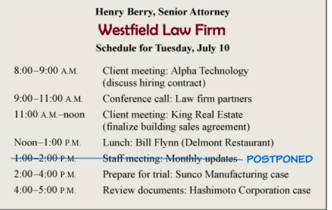
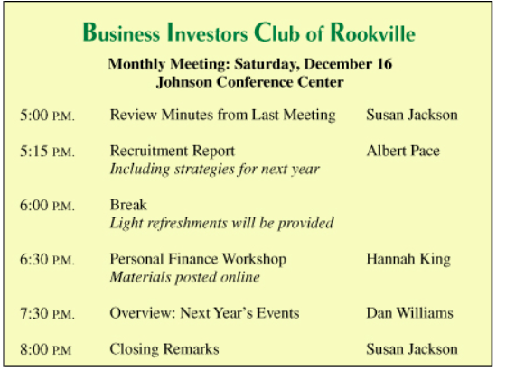
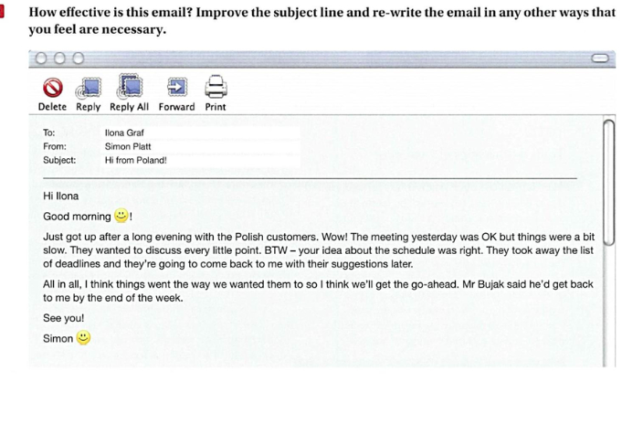

# 05/12/2019 - CHECKED

1. You can  /  **Could you** / You will / You 

 please arrange accommodation for me near to your offices?  

2. We  __________ if you could send us the confirmation as soon as possible. 

will be grateful / **would be grateful** /  would be happy /  will be glad

3. Unfortunately we  _________to change the contract.

can't / cannot / **are unable** /  unable

4. If possible I  _______ to make an appointment to see you to discuss the new contract for next year. 

want / **would like** / would / like

5. I  ______________at the sales meeting next week. 

 look forward to / look forward for seeing / look to / **look forward to seeing you**

6. Feel to _________contact me if you need any more information. 

Glad  / **free** / fine / liberated 

7. I have placed an order but need some more details ___________shipment.  

For / on / **regarding** / concerned 

8. Do not __________ contact me if you need any more information. 

Wait to / stop / appreciate / **hesitate to** / hesitate  

9. Please  ____ your decision as soon as possible. 

make me / **let me know**  / give / let me 

10. We look forward to a successful working relationship  ___________

in the future / **on future** / at the future / to future .

# 28/11/2018

**Emailing Phrases- Tenses and Verb Forms Review** 

Put the verbs below into the correct form in the gaps which are given, adding “to” or the correct form of “be” or “have” if you need to. Some don’t need to be changed to be correct. 

1 I _’m writing______________________________(write) to you about the meeting next week. 

2 Please phone us if you ______get___________________________________(get) lost. 

3 Here’s the information that you ________________asked____________________(ask) for. 

4 I _’ve attached___________am attaching________attached__________________________(attach) the excel document. XL

5 Any assistance you could give me with this matter __would_________(be) greatly appreciated. 

6 I _’ll complete_____am going to _______________________(complete) it next week, if that is okay with you. 

7 I’m looking forward to ____hearing______________________________(hear) from you soon.

 8 I regret _________to inform_____________________________________(inform) you that… 

9 If you have any further questions, please _____do not hesitate__________________(not hesitate) to contact me at any time. 

10 I _____________________don’t have___________________________________ (not have) time to reply in detail at the moment, but I thought that I should let you know… 

11 I’m afraid I ______will be attending I’m attending ___________________(attend) a conference overseas on that day. 

12 I ___am arranging________________(arrange) to visit one of your colleagues on Wed 25th March. 

13 It __________was__________________________(be) a pleasure to meet you yesterday. 

14 I ______would be__________________________(be) very glad to fit you in any time after that. 

15 I ____________will do_________________________________(do) it as soon as possible. 

16 How about _________coming__________________(come) for a drink with us on Tuesday? 

17 I’m writing _______to enquire_____________________________________(enquire) about… 

18 If you have any more questions, please _____let____________________(let) me know. 

19 I _’m going _____________(go) to a meeting in a minute but I thought I’d better let you know… 

20 I’m sorry that it ____took____________________(take) me so long to reply to your email. 

21 It _______was_________________________________(be) great to meet you yesterday. 

22 I ______________would____________________(like) to ask for some information about… 

23 I ____________’ll do_______________________________________(do) it immediately. 

24 I’m looking forward to ___receiving__________________________(receive) your comments. 

Imperative 

Could you please

25 _____________Give_________________________________(give) my regards to John. 

26 I’m sorry _____________to tell____________________________________(tell) you that… 

27 I __________________________I’m visiting_____________________________________(visit) one of your colleagues on Wed 25th March, so I can see you then. 

28 Long time no see. How_____have you been_____________________________________(you be)? 

29 You also ______________asked________________________________(ask) me about… 

30 I ____________’llget______________________________(get) back to you by Tuesday. 

31 I _________________would love___________________________________(love) come, but… 

32 Looking forward to __hearing_____________________________________ (hear) from you. 

33 The amount that you sent does not seem ______to be___________________(be) correct. 

34 If anything about that isn’t clear, please ______drop_________________(drop) me a line. 

35 I ____’m writing___________________(write) to you in connection with the meeting next week. 

36 Thank you for your email, which I ______have just received______________________(just receive). 

37 Wednesday ___________would be__________________________(be) good, if that suits you. 

38 I _____________’ll finish_________________________________(finish) it as soon as I can. 

39 Please _________pass give___________________________(pass) my best wishes onto John.

 40 I’m looking forward to _________seeing______________________________(see) you then. 

41 This is just a quick note _______to say___________________________________(say)…


# 05/11/2019

## Please check my homework

````
Hello Karyn,  

I hope you are doing well.

I've done my homework. I've attached it below.
Could you verify it, please?

See you today!  

Serzh
````


## Formal or informal №1

| №    | Informal                     | Formal                                                  |
| ---- | ---------------------------- | ------------------------------------------------------- |
| 1    | What do you need?            | Please let us know your requirements.                   |
| 2    | Thanks for your email.       | Thank you for you email of 12 February.                 |
| 3    | Sorry, I can't make it       | Unfortunately I will not be able to attend the meeting. |
| 4    | Could you ...?               | I was wondering if you could ...?                       |
| 5    | I promise ...                | I can assure you that ...                               |
| 6    | You haven't                  | We note from our records that you have not ...          |
| 7    | I'm sorry to tell you that   | We regret to advise you that ...                        |
| 8    | I'll deal with this          | I will take the necessary  action to solve this issue.  |
| 9    | Don't forget that ...        | We would like to remind you that ...                    |
| 10   | I need to ...                | It is necessary for me to ...                           |
| 11   | Shall I ... ?                | Would you like me to ...?                               |
| 12   | But ... / Also ... / So .... | However ... / In addition ... / Therefore ...           |
| 13   | Please ...                   | I would be grateful if you could                        |
| 14   | I'm really sorry about ...   | Please accept my apologies for ...                      |
| 15   | Re ...                       | With reference to .. (or Regarding ...)                 |
| 16   | See you next week            | I look forward to meeting you next week.                |

## Formal or informal №2

| Formal                                                       | Informal                                   |
| ------------------------------------------------------------ | ------------------------------------------ |
| **Previous contact**                                         |                                            |
| With reference to your email sent (date), ...                | Re your last email ...                     |
| **Reason for email**                                         |                                            |
| We are writing to inform you that ...                        | Just a short note to let you know  ...     |
| **Good news**                                                |                                            |
| You will be please to hear that ...                          | Good news!                                 |
| We are able to confirm that ...                              | I can confirm that ...                     |
| **Bad news/Apologizing**                                     |                                            |
| I apologize for ...                                          | Sorry for ...                              |
| We regret to inform you that ...                             | Unfortunately ...                          |
| **Requests**                                                 |                                            |
| I'd be grateful if you could ...                             | Please                                     |
| I would appreciate it if you could ...                       | Can you                                    |
| **Offering help**                                            |                                            |
| Would you like me to ...?                                    | Do you want me to ...?                     |
| If you wish, I would be happy to ...                         | If you like I can ...                      |
| **Promising action**                                         |                                            |
| I will contact you again.                                    | I'll get back to you.                      |
| **Attachments**                                              |                                            |
| Please find attached ...                                     | I’ve attached                              |
| **Final comments**                                           |                                            |
| Thank you for your assistance.                               | Thanks for your help.                      |
| Do not hesitate to contact us again if you need any further information. | If there’s anything else just let me know. |
| **Closing**                                                  |                                            |
| We are looking forward to ...                                | Looking forward to                         |
| Yours/Sincerely                                              | Regards/Best wishes                        |


## Formal or informal emails

### **Email1**

**Formal**

Unfortunately I will not be able to attend the meeting on Friday. As I will miss the meeting, I was wondering if you could send me a copy of the minutes? I will write to Rina as well, to inform her that I will not be there. Once again, please accept my apologies for this.

**Informal**

Sorry I can't make it on Friday. As I'll mess the meeting, could you send me a copy of the minutes? I will write to Rina as well, to inform her that I will not be there. Once again, I'm really sorry about this.

### Email2

**Formal**

Thank you for your email of 25 January where you requested assistance on how to receive an online discount. It is necessary for me to know you a/c number before I can take action to solve this issue. I would be grateful if you could also let me know which browser you are using.

**Informal**

Thank you for you email where you requested assistance on how to receive an online discount. I need to know you a/c number before I can take action to solve this issue. Could you also let me know which browser you are using?

### Email3

**Formal**

I am writing with reference to your order number 8916. We received the order this morning via our website, but you have not filled in the section about size. Please let us know your requirements. These products are selling very well, and we regret to advise you that the medium size is temporarily out of stock. However, we are expecting more to arrive in the near future. Would you like me to email you when they are back in stock?

**Informal**

Re: order number 8916

We received the order this morning via our website, but you have not filled in the section about size. What size do you need? These products are selling very well, and I'm sorry to tell you that the medium size is temporarily out of stock. However, we are expecting more to arrive in the near future. Shall I email you when they are back in stock?


# 31/10/2019

## Words and phrases

- Copenhagen
- Usual set of headphones
- Happy Halloween!!!!
- Trick or treat


## Email 1  - Invite Serzh to your team meeting November 8 at 2:00 pm

````
Hi, Serzh!

I hope you are doing well.

You had expressed interest in coming to one of our team meetings.
So I would like to invite you on November 8th at 2:00pm.

Please let me know if you are available on that date and I will send you an agenda.

Best, Andrey
````

**Request 1**

````
Hi Andrey,

Thanks for the invite.

Yes I am available on November 8th

Please send me the agenda.

Best, Serzh
````

**Request 2**

````
Great! I have attached the agenda.
See you then.

Best, Andrey
````


## Email 2 - Request a report on November 8 but now you need this Friday

````
Hi Evgenia,

I hope you are having a great day!

Previously, I had asked you for the end of the month report on November 8th.
Unfortunately, I just had a meeting with my director, Donnie, and he is now requesting the report a week earlier.

Could you please send me the report on November 1?
    
I would really appreciate it.
Please let me know if you are unable to do this.

Thank you, Yuliya.
````

**Request**

````
Hi Yulia!

I am responding to your email and unfortunately I am swamped today.

There is just no way I am available to prepare the requested report by tomorrow. I have several other deadlines tomorrow. Could I send it to you by end of day Monday?
    
Best, Evgenia.   
````

## Conversation 1





## Conversation 2



### Email 1

````
Hi Serzh,

I hope you are well. I know we have our monthly investors meeting coming up. Unfortunately, I am away on business and left my agenda in the office.

Could you send me the day, time and place of the meeting?

Also, I can't remember if I was supposed to present a workshop.
I believe I was asked to head up-lead the personal finance workshop. I’m not sure though and I would appreciate it if you could confirm that.

See you soon,

Susan 
````

### Email 2

````
Hi Susan,

I hope this email finds you well.

The meeting will be on Saturday, December 16 in Johnson Conference Center. The meeting starts at 5:00pm and the last speaker goes on at 8:00pm.

Regarding (In reference to) finance workshop, Hannah King will lead it at 6:30pm.
From the agenda you should lead the opening and closing conference:
- 5:00pm - 5:15pm - Review minutes from Last Meeting
- At 8:00pm - Closing Remarks

Please let me know if you have any other questions.

See you soon,
Serzh
````


## Rewriting



### Rewriting

````
Title: Summary of meeting with Polish customer
 
Hi Liona,
 
I hope you are well!
 
We had a very long meeting with Polish customers yesterday. The meeting was good,
but very slow. They wanted to discuss every little point.
 
Also, you were right about the schedule. They took away the list of deadlines and they are going to consider it and make their suggestions.
 
Mr. Bujak will get an answer by the end of the week. 
Will get back to us by the end of the week. (Will provide an answer/Will provide a response)

Please let me know if you have any questions or if you need additional information.

See you!
Simon
````

